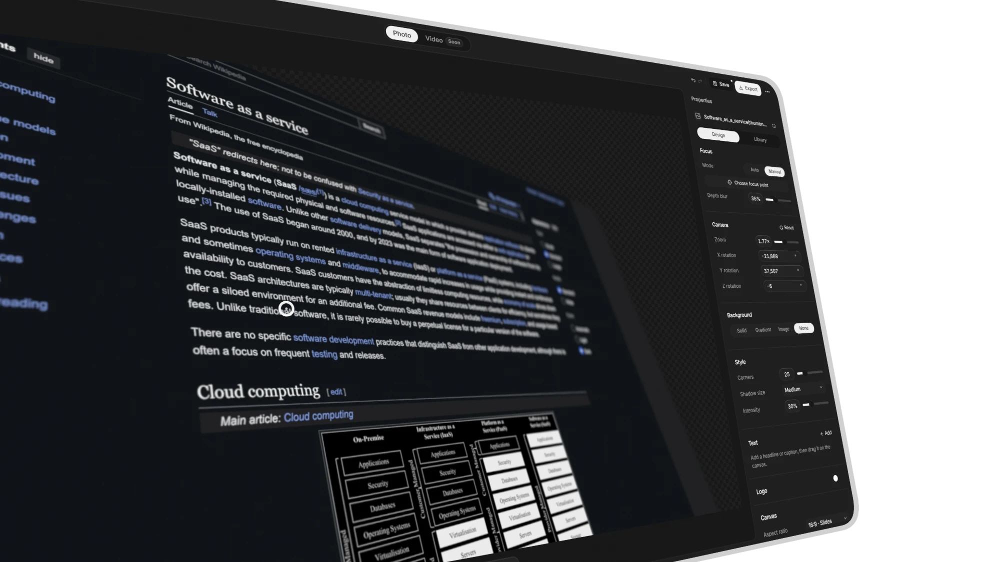

<p align="center">
  <picture>
    <source media="(prefers-color-scheme: dark)" srcset="public/brand/logo-white.svg" />
    
  </picture>
</p>

<h1 align="center">Project Camera</h1>

<p align="center">
  <b>A private photo studio for product shots and UI mockups.</b><br />
  Drop in a screenshot, frame it with a real 3D camera, add depth blur and shadows, and export a polished PNG.
</p>

<p align="center">No account · No uploads · No tracking · No watermark</p>

<p align="center">
  
</p>

---

## ✨ Features

- **Camera:** zoom, rotate and tilt your image in true 3D perspective
- **Depth blur:** pick a focus point by hand or automatically and set the blur strength
- **Design:** background, soft shadow, aspect ratio, text and logos
- **Export:** PNG at HD, 2K, 4K or a custom size, with transparency
- **Projects:** save your work in the browser and export project files to move it between devices

## 🔒 Privacy

Project Camera runs entirely in your browser. Images, videos and projects never leave your device: there is
no backend, no analytics and no third-party request. Projects live in the browser's IndexedDB, so
clearing site data deletes them. Use **Projects → Export project file** to keep a backup.

The published site enforces this with a strict Content Security Policy that only allows the site's
own files.

## 🚀 Run it locally

You need [Node.js 24](https://nodejs.org/en/download) and [Git](https://git-scm.com/downloads).

```sh
git clone https://github.com/leifiyoo/project-camera.git
cd project-camera
npm ci
npm run dev
```

Then open [localhost:3000](http://localhost:3000). On Windows PowerShell, use `npm.cmd` if `npm` is blocked.

## 🎨 How to use it

1. **Import** an image (PNG, JPG, WebP, AVIF, GIF or SVG): drop it anywhere, paste it, or use **Upload photo**.
2. **Adjust** the camera, focus and design in the sidebar. Ctrl/Cmd + drag rotates, Ctrl/Cmd + scroll zooms.
3. **Save** it to Projects with Ctrl/Cmd + S, and **export** it as a PNG.

Click the logo to start a new project; Project Camera asks before it drops unsaved work. It works best in a
current desktop Chrome, Edge or Safari. 3D perspective and depth blur need WebGL; without it you get
a flat view.

## ☁️ Deploy

`npm run build` produces a static site in `out/`. It needs no server and no environment variables.

| Host                          | Setup                                                                                   |
| ----------------------------- | --------------------------------------------------------------------------------------- |
| **Vercel**                    | Import the repository. The Next.js preset works as is; headers come from `vercel.json`. |
| **Cloudflare Pages**          | Build command `npm run build`, output directory `out`. Headers come from `_headers`.    |
| **Cloudflare Workers**        | `npm run build`, then `npx wrangler deploy` (uses `wrangler.jsonc`).                    |
| **Netlify / any static host** | Publish `out/`. Netlify reads `_headers`; elsewhere, copy its rules to your server.     |

Set the Node.js version to 24 on hosts that don't read `.nvmrc`.

To preview a production build locally, run `npm run build` and serve `out/` with any static file
server, for example `npx serve out`.

## 🧪 Development

```sh
npm run typecheck   # TypeScript
npm run lint        # ESLint
npm test            # Unit tests (Vitest)
npm run format      # Prettier
npm run build       # Static production build in out/
```

CI runs these checks on Linux, Windows and macOS.

<details>
<summary><b>Project structure</b></summary>

Built with Next.js (static export), TypeScript, React, Three.js and Zustand.

| Folder                  | What's inside                                      |
| ----------------------- | -------------------------------------------------- |
| `src/app`               | Page shell, styles, app icons                      |
| `src/components/editor` | Editor UI: stage, sidebar, timeline, export dialog |
| `src/components/ui`     | Shared controls and the logo                       |
| `src/lib/studio`        | Project documents, undo, camera and easing logic   |
| `src/lib/media`         | Image/video import, thumbnails, SVG sanitizing     |
| `src/lib/render`        | Three.js renderer with depth blur and shadows      |
| `src/lib/export`        | PNG and video export                               |
| `src/lib/storage`       | IndexedDB storage and ZIP import/export            |
| `scripts/csp.mjs`       | Adds the Content Security Policy after the build   |

</details>

## 📄 License

Project Camera is licensed under the [GNU General Public License v3.0](LICENSE).
Third-party code, fonts and dependencies keep their own licenses; see
[THIRD_PARTY_NOTICES.md](THIRD_PARTY_NOTICES.md). Security reports: see [SECURITY.md](SECURITY.md).
